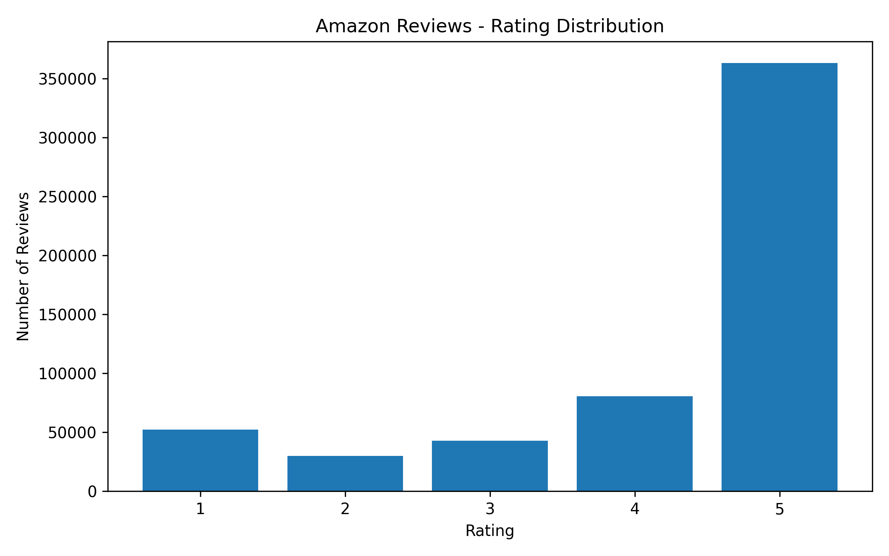
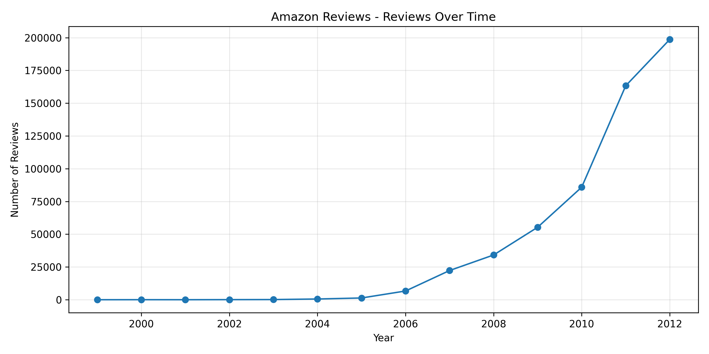
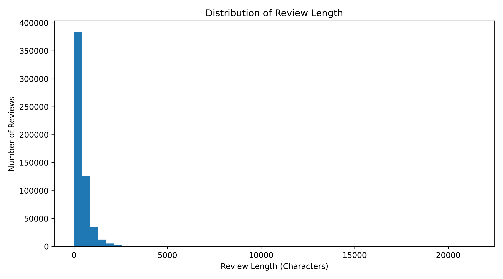
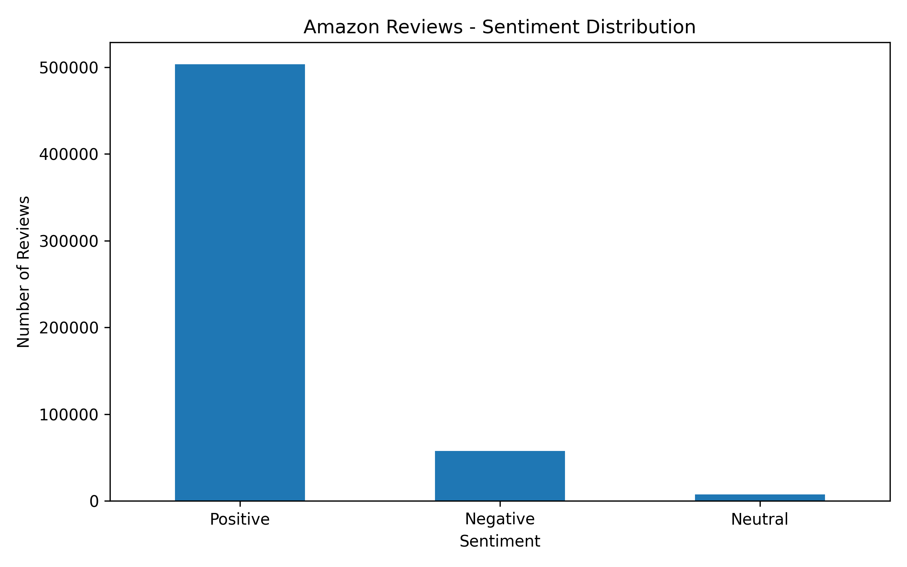
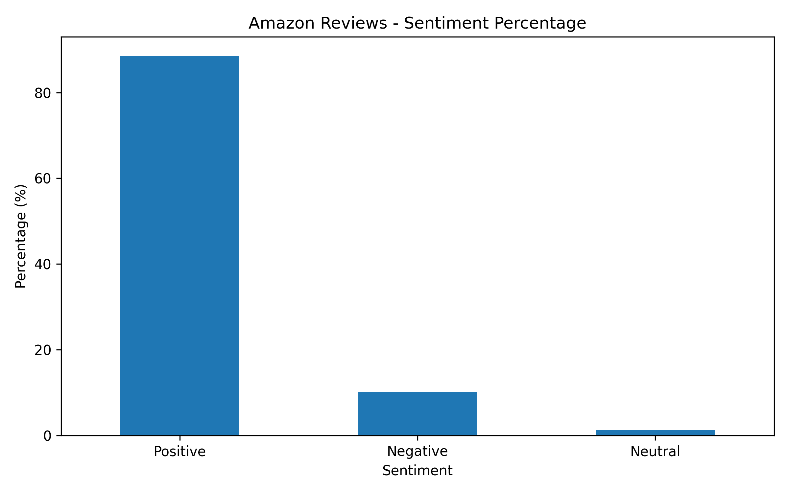
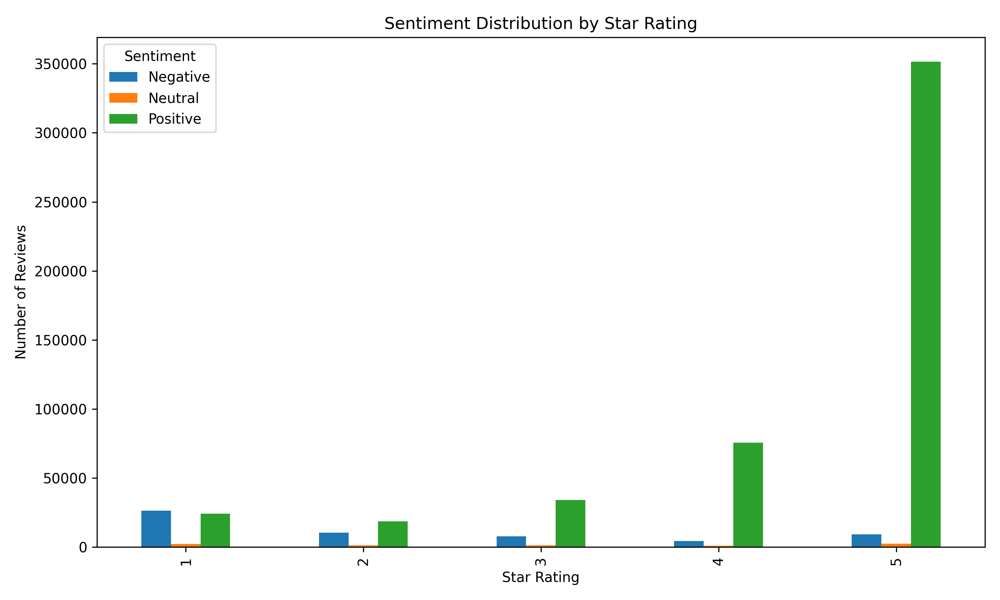

# Amazon Reviews Data Analytics

## Project Overview

This project was developed as part of the **CodeAlpha Data Analytics Internship**.

The project analyzes a large Amazon Reviews dataset to identify patterns in customer ratings, review activity, product performance, review helpfulness, and customer sentiment.

Three data analytics tasks were completed:

- **Task 2 — Exploratory Data Analysis (EDA)**
- **Task 3 — Data Visualization**
- **Task 4 — Sentiment Analysis**

## Dataset

The dataset contains **568,454 Amazon customer reviews** and **10 variables**.

### Dataset Columns

- Id
- ProductId
- UserId
- ProfileName
- HelpfulnessNumerator
- HelpfulnessDenominator
- Score
- Time
- Summary
- Text

The dataset is stored locally in SQLite format.

> The original dataset is not included in this GitHub repository because of its large file size.

## Task 2 — Exploratory Data Analysis

Exploratory Data Analysis was performed using **Python and Pandas** to understand the structure, quality, and characteristics of the dataset.

### Analysis Performed

- Dataset dimensions and structure
- Column and data type analysis
- Missing value analysis
- Duplicate record analysis
- Statistical summary
- Rating distribution
- Average customer rating
- Review length analysis
- Helpfulness analysis
- Reviews by year
- Most-reviewed products
- Product average ratings
- High-rating and low-rating reviews
- Basic data-quality anomaly checks

### Main Script

`analysis.py`

### EDA Results

- **568,454 total reviews**
- **10 columns**
- **0 missing values**
- **0 duplicate records**
- **Average rating: 4.18 / 5**
- **Average review length: 436 characters**
- **Average helpfulness ratio: 0.78**

### Rating Distribution

| Rating | Reviews | Percentage |
|---|---:|---:|
| 1 Star | 52,268 | 9.19% |
| 2 Stars | 29,769 | 5.24% |
| 3 Stars | 42,640 | 7.50% |
| 4 Stars | 80,655 | 14.19% |
| 5 Stars | 363,122 | 63.88% |

The majority of reviews are **5-star reviews**, representing **63.88%** of the dataset.

Reviews with ratings of **4 or 5 stars account for 78.07%** of all reviews.

Reviews with ratings of **1 or 2 stars account for 14.43%** of the dataset.

### Review Activity Over Time

The highest number of reviews was recorded in **2012**, with **198,659 reviews**.

### Product Analysis

The most-reviewed product received **913 reviews**.

Product ID:

`B007JFMH8M`

The highest average rating among the analyzed products was approximately **4.97 / 5**.

### Data Quality

The analysis found:

- No missing values
- No duplicate records
- No ratings below 1
- No ratings above 5
- No negative helpfulness values

Two records were identified where the helpfulness numerator was greater than the denominator. These records may require further data-quality investigation.

## Task 3 — Data Visualization

Several visualizations were created using **Matplotlib**.

### Visualizations Created

1. Rating Distribution
2. Rating Percentage
3. Reviews Over Time
4. Average Rating Over Time
5. Top 10 Products by Review Count
6. Review Length Distribution
7. Helpfulness by Rating

All visualization files are stored in the `charts/` folder.

### Main Script

`visualization.py`

### Rating Distribution



### Reviews Over Time



### Review Length Distribution



## Task 4 — Sentiment Analysis

Sentiment analysis was performed using **NLTK VADER (Valence Aware Dictionary and sEntiment Reasoner)**.

The `Summary` and `Text` fields were combined to analyze the overall sentiment of each review.

Each review was classified into:

- **Positive**
- **Neutral**
- **Negative**

### Sentiment Classification

- Compound Score >= 0.05 → Positive
- Compound Score <= -0.05 → Negative
- Between -0.05 and 0.05 → Neutral

The sentiment analysis also compares customer sentiment with their corresponding star ratings.

### Main Script

`sentiment.py`

### Sentiment Outputs

The following files are generated inside the `sentiment_results/` folder:

- sentiment_distribution.png
- sentiment_percentage.png
- sentiment_vs_rating.png
- sentiment_results.csv
- sentiment_summary.csv

### Sentiment Distribution



### Sentiment Percentage



### Sentiment vs Rating



> Exact sentiment percentages are generated by `sentiment.py` and stored in `sentiment_summary.csv`.

## Key Findings

- The dataset contains **568,454 reviews**.
- The overall average customer rating is **4.18 out of 5**.
- **5-star reviews represent 63.88%** of all reviews.
- **4- and 5-star reviews represent 78.07%** of the dataset.
- **1- and 2-star reviews represent 14.43%** of the dataset.
- The average review length is approximately **436 characters**.
- The average helpfulness ratio is approximately **0.78**.
- The dataset contains **no missing values**.
- The dataset contains **no duplicate rows**.
- Review activity was highest in **2012**, with **198,659 reviews**.
- The most-reviewed product received **913 reviews**.
- Basic anomaly checking identified **2 records** where the helpfulness numerator was greater than the denominator.

Overall, the dataset shows a strong concentration of positive customer ratings and substantial growth in review activity in the later years covered by the dataset.

## Technologies Used

- Python
- Pandas
- Matplotlib
- SQLite
- NLTK
- VADER Sentiment Analysis

## Project Structure

```text
Amazon_Reviews_Project/
│
├── analysis.py
├── visualization.py
├── sentiment.py
├── requirements.txt
├── README.md
├── .gitignore
│
├── charts/
│   ├── rating_distribution.png
│   ├── rating_percentage.png
│   ├── reviews_over_time.png
│   ├── average_rating_over_time.png
│   ├── top_10_products.png
│   ├── review_length_distribution.png
│   └── helpfulness_by_rating.png
│
├── sentiment_results/
│   ├── sentiment_distribution.png
│   ├── sentiment_percentage.png
│   ├── sentiment_vs_rating.png
│   └── sentiment_summary.csv
│
└── data/
    └── Local Amazon Reviews Dataset
````

## How to Run the Project

### 1. Install Dependencies

```bash
pip install -r requirements.txt
```

### 2. Run Exploratory Data Analysis

```bash
python analysis.py
```

### 3. Generate Data Visualizations

```bash
python visualization.py
```

### 4. Run Sentiment Analysis

```bash
python sentiment.py
```

## Project Objectives

1. Understand the structure and quality of Amazon review data.
2. Analyze customer rating patterns.
3. Identify trends in review activity.
4. Analyze product-level review behavior.
5. Understand review length and helpfulness.
6. Create meaningful data visualizations.
7. Perform sentiment analysis using NLP.
8. Compare customer sentiment with star ratings.
9. Gain practical experience with a large real-world dataset.

## Conclusion

This project demonstrates a complete data analytics workflow using a large real-world Amazon Reviews dataset.

The project combines data loading, data quality checking, exploratory data analysis, statistical analysis, data visualization, natural language processing, and sentiment analysis.

Through this project, practical experience was gained with **Python, Pandas, Matplotlib, SQLite, NLTK, and VADER sentiment analysis**.

The analysis provides useful insights into customer ratings, review behavior, product activity, helpfulness, and customer sentiment.

## Internship Information

**Program:** CodeAlpha Data Analytics Internship

**Completed Tasks:**

* Task 2 — Exploratory Data Analysis
* Task 3 — Data Visualization
* Task 4 — Sentiment Analysis

**Project Type:** Data Analytics / NLP

**Repository:** `CodeAlpha_Amazon_Reviews_Data_Analytics`

